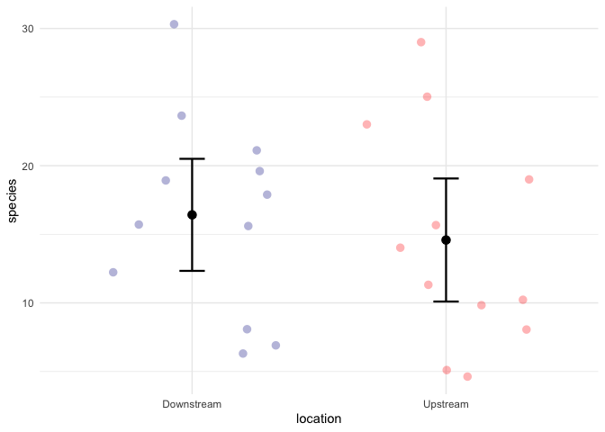
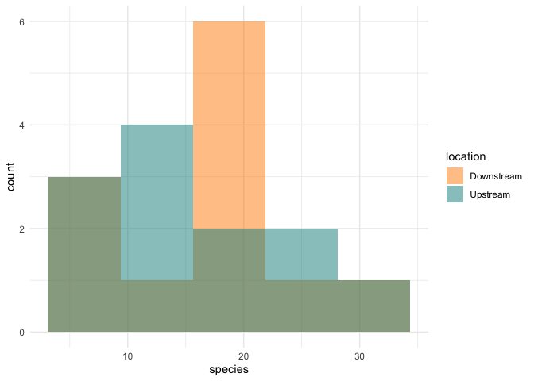
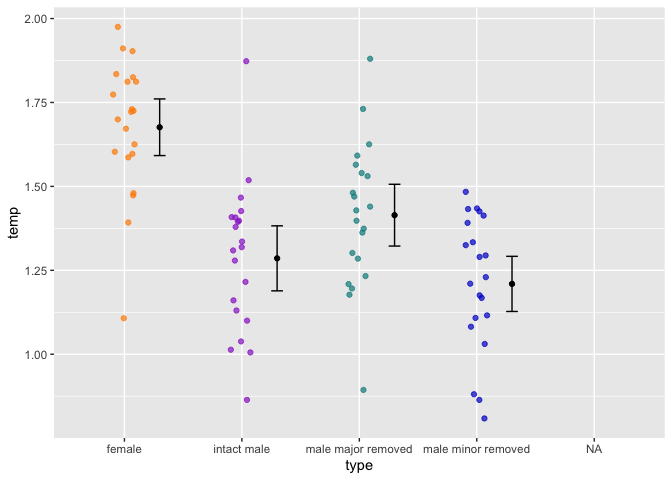

Lab 6 Comparing Two Means
================
Amaya Jerdee
5/3/2021

Researchers studying the number of electric fish species living in
various parts of the Amazon basin were interested in whether the
presence of tributaries affected the local number of electric fish
species in the main rivers (Fernandes et al. 2004).

They counted the number of electric fish species above and below the
entrance point of a major tributary at 12 different river locations.

The data is provided in your GitHub repository.

For each question below, write a sentence answering the question and
show the code you used to come up with the answer, if applicable.

``` r
# load packages -----------------------------------------------------------
library(tidyverse)
```

    ## Warning in file(con, "r"): cannot open file '/var/db/timezone/zoneinfo/
    ## +VERSION': No such file or directory

    ## ── Attaching packages ─────────────────────────────────────── tidyverse 1.3.0 ──

    ## ✓ ggplot2 3.3.3     ✓ purrr   0.3.4
    ## ✓ tibble  3.0.5     ✓ dplyr   1.0.4
    ## ✓ tidyr   1.1.2     ✓ stringr 1.4.0
    ## ✓ readr   1.4.0     ✓ forcats 0.5.0

    ## ── Conflicts ────────────────────────────────────────── tidyverse_conflicts() ──
    ## x dplyr::filter() masks stats::filter()
    ## x dplyr::lag()    masks stats::lag()

``` r
# read data ---------------------------------------------------------------

fish <- read_csv("chap12q19ElectricFish.csv")
```

    ## 
    ## ── Column specification ────────────────────────────────────────────────────────
    ## cols(
    ##   tributary = col_character(),
    ##   speciesUpstream = col_double(),
    ##   speciesDownstream = col_double()
    ## )

``` r
fish_long <- 
  pivot_longer(fish, speciesUpstream:speciesDownstream,
               names_to = "location",
               values_to = "species") %>% 
  mutate(location = str_remove(location, c("species"))) %>% 
  print()
```

    ## # A tibble: 24 x 3
    ##    tributary location   species
    ##    <chr>     <chr>        <dbl>
    ##  1 Içá       Upstream        14
    ##  2 Içá       Downstream      19
    ##  3 Jutaí     Upstream        11
    ##  4 Jutaí     Downstream      18
    ##  5 Japurá    Upstream         8
    ##  6 Japurá    Downstream       8
    ##  7 Coari     Upstream         5
    ##  8 Coari     Downstream       7
    ##  9 Purus     Upstream        10
    ## 10 Purus     Downstream      16
    ## # … with 14 more rows

``` r
head(fish)
```

    ## # A tibble: 6 x 3
    ##   tributary  speciesUpstream speciesDownstream
    ##   <chr>                <dbl>             <dbl>
    ## 1 Içá                     14                19
    ## 2 Jutaí                   11                18
    ## 3 Japurá                   8                 8
    ## 4 Coari                    5                 7
    ## 5 Purus                   10                16
    ## 6 Manacapuru               5                 6

``` r
str(fish)
```

    ## tibble [12 × 3] (S3: spec_tbl_df/tbl_df/tbl/data.frame)
    ##  $ tributary        : chr [1:12] "Içá" "Jutaí" "Japurá" "Coari" ...
    ##  $ speciesUpstream  : num [1:12] 14 11 8 5 10 5 23 29 19 16 ...
    ##  $ speciesDownstream: num [1:12] 19 18 8 7 16 6 24 30 16 20 ...
    ##  - attr(*, "spec")=
    ##   .. cols(
    ##   ..   tributary = col_character(),
    ##   ..   speciesUpstream = col_double(),
    ##   ..   speciesDownstream = col_double()
    ##   .. )

``` r
# perform tasks -----------------------------------------------------------

t.test(formula = species ~ location, data = fish_long)  #t-test
```

    ## 
    ##  Welch Two Sample t-test
    ## 
    ## data:  species by location
    ## t = 0.59249, df = 21.81, p-value = 0.5596
    ## alternative hypothesis: true difference in means is not equal to 0
    ## 95 percent confidence interval:
    ##  -4.587031  8.253697
    ## sample estimates:
    ## mean in group Downstream   mean in group Upstream 
    ##                 16.41667                 14.58333

``` r
ttest_results <- t.test(formula = species ~ location, data = fish_long)

ttest_results
```

    ## 
    ##  Welch Two Sample t-test
    ## 
    ## data:  species by location
    ## t = 0.59249, df = 21.81, p-value = 0.5596
    ## alternative hypothesis: true difference in means is not equal to 0
    ## 95 percent confidence interval:
    ##  -4.587031  8.253697
    ## sample estimates:
    ## mean in group Downstream   mean in group Upstream 
    ##                 16.41667                 14.58333

``` r
diff(ttest_results$estimate)
```

    ## mean in group Upstream 
    ##              -1.833333

## Question A

> What is the mean difference in the number of species between areas
> upstream and downstream of a tributary? What is the 95% confidence
> intervalof this mean difference. Show your code and write a sentence
> giving your answer.

ANSWER

The mean difference in the number of species between areas is 1.8334 and
the 95% confidence interval is -4.587031 to 8.253697.

``` r
fish_long_data <-
  fish_long %>% 
  group_by(location) %>% 
  summarize(
    n = n(),
    mean = mean(species),
    sd = sd(species),
    sem = sd/sqrt(n),
    upper = mean + 1.96 * sem,
    lower = mean - 1.96 * sem
  ) %>% 
  print()
```

    ## # A tibble: 2 x 7
    ##   location       n  mean    sd   sem upper lower
    ## * <chr>      <int> <dbl> <dbl> <dbl> <dbl> <dbl>
    ## 1 Downstream    12  16.4  7.22  2.08  20.5  12.3
    ## 2 Upstream      12  14.6  7.93  2.29  19.1  10.1

``` r
fish_long %>% 
  ggplot(aes(x = location, y = species)) + 
  geom_jitter(aes(color = location), 
              shape = 16, size = 3, 
              alpha = 0.3, width = 0.4) + 
  geom_errorbar(aes(y = mean, ymax = upper, ymin = lower), 
                data = fish_long_data, 
                width = 0.1, size = 0.8) + 
  geom_point(aes(y = mean), 
             data = fish_long_data, 
             size = 3) + 
  scale_color_manual(values = c("dark blue","red")) + 
  theme_minimal() + 
  guides(color = "none")
```

<!-- --> \#\# Question B

> Test the hypothesis that the tributaries have no effect on the number
> of species of electric fish.

ANSWER

According to the t-test there is no signigicant difference between the
species and the location due to p&gt;0.05. The difference between the
means falls within the 95% confidence interval. With this being said, we
fail to reject the null hypothesis.

``` r
t.test(formula = species ~ location, data = fish_long)
```

    ## 
    ##  Welch Two Sample t-test
    ## 
    ## data:  species by location
    ## t = 0.59249, df = 21.81, p-value = 0.5596
    ## alternative hypothesis: true difference in means is not equal to 0
    ## 95 percent confidence interval:
    ##  -4.587031  8.253697
    ## sample estimates:
    ## mean in group Downstream   mean in group Upstream 
    ##                 16.41667                 14.58333

## Question C

> State the assumptions that you had to make to complete parts (A) and
> (B). Create a graph to assess whether one of those assumptions was
> met.

ANSWER

We assumed that the number of species were normally distributed, the
measurements were taken from a random sample, and the standard deviation
of the number of species were equivalent in both samples when performing
the two-sample t-test. When looking at the graph below, the assumption
that the number of species were normally distributed was not accurate.

``` r
fish_long %>% 
  ggplot(aes(x = species)) +
  geom_histogram(
    aes(fill = location), 
    bins = 5, 
    alpha = 0.5, 
    position = "identity"
  ) +
  scale_fill_manual(values = c("darkorange","cyan4")) +
  theme_minimal()
```

<!-- -->

## ANOVA

Fiddler crabs are so called because males have a greatly enlarged
“major” claw, which is used to attract females and to defend a burrow.

Darnell and Munguia (2011) recently suggested that this appendage might
also act as a heat sink, keeping males cooler while out of the burrow on
hot days.

To test this, they placed four groups of crabs into separate plastic
cups and supplied a source of radiant heat (60-watt light bulb) from
above. The four groups were intact male crabs, male crabs with the major
claw removed; male crabs with the other (minor) claw removed (control);
and intact female fiddler crabs.

They measured the body temperature of crabs every 10 minutes for 1.5
hours. These measurements were used to calculate a rate of heat gain for
every individual crab in degrees C/log minute. Rates of heat gain for
all crabs are provided in the accompanying data file.

``` r
Crab <- read_csv("chap15q27FiddlerCrabFans.csv") %>% 
  rename(type = crabType, temp = bodyTemperature) 
```

    ## 
    ## ── Column specification ────────────────────────────────────────────────────────
    ## cols(
    ##   crabType = col_character(),
    ##   bodyTemperature = col_double()
    ## )

``` r
Crab
```

    ## # A tibble: 85 x 2
    ##    type    temp
    ##    <chr>  <dbl>
    ##  1 female   1.9
    ##  2 female   1.6
    ##  3 female   1.4
    ##  4 female   1.1
    ##  5 female   1.6
    ##  6 female   1.8
    ##  7 female   1.9
    ##  8 female   1.7
    ##  9 female   1.5
    ## 10 female   1.8
    ## # … with 75 more rows

``` r
temp_means <- 
  Crab %>% 
  filter(!is.na(temp)) %>%     #remove missing values 
  group_by(type) %>% 
  summarize( 
    mean = mean(temp), 
    sd = sd(temp), 
    n = n(), 
    sem = sd / sqrt(n), 
    upper = mean + 1.96 * sem, 
    lower = mean - 1.96 * sem
  ) %>% 
  print() 
```

    ## # A tibble: 4 x 7
    ##   type                mean    sd     n    sem upper lower
    ## * <chr>              <dbl> <dbl> <int>  <dbl> <dbl> <dbl>
    ## 1 female              1.68 0.197    21 0.0430  1.76  1.59
    ## 2 intact male         1.29 0.226    21 0.0494  1.38  1.19
    ## 3 male major removed  1.41 0.215    21 0.0469  1.51  1.32
    ## 4 male minor removed  1.21 0.192    21 0.0419  1.29  1.13

## Question D

Graph the distribution of body temperatures for each crab type:

``` r
ggplot(data = Crab, aes(x = type, y = temp)) + 
  geom_jitter(aes(color = type), 
              width = 0.1, 
              alpha = 0.7, 
              show.legend = FALSE, 
              na.rm = TRUE) + 
  geom_errorbar(aes(y = mean, ymin = lower, ymax = upper), 
                data = temp_means,
                width = 0.1, position = position_nudge(0.3)) + 
  geom_point(aes(y = mean), data = temp_means, 
             position = position_nudge(0.3)) + 
  scale_color_manual(values = c("darkorange","darkorchid","cyan4","blue3"))
```

<!-- -->

## Question E

> Does body temperature varies among crab types? State the null and
> alternative hypothesis, conduct an ANOVA, and interpret the results.

ANSWER

The null hypothesis is that the mean body temperature is equal between
the crab types. The alternative hypothesis is that the mean body
temperatureis different in at least one type of crab. The null
hypothesis is rejected while the alternative hypothesis is accepted
(p&lt;0.05). The difference between the mean body temperature in at
least one type of crab and the mean body temperature of the other types
of crbas is significantlly statistically different.

``` r
aov_crab_summary <- 
  aov(temp ~ type, data = Crab) 
aov_crab_summary 
```

    ## Call:
    ##    aov(formula = temp ~ type, data = Crab)
    ## 
    ## Terms:
    ##                     type Residuals
    ## Sum of Squares  2.641310  3.467619
    ## Deg. of Freedom        3        80
    ## 
    ## Residual standard error: 0.2081952
    ## Estimated effects may be unbalanced
    ## 1 observation deleted due to missingness

``` r
summary(aov_crab_summary)
```

    ##             Df Sum Sq Mean Sq F value Pr(>F)    
    ## type         3  2.641  0.8804   20.31  7e-10 ***
    ## Residuals   80  3.468  0.0433                   
    ## ---
    ## Signif. codes:  0 '***' 0.001 '**' 0.01 '*' 0.05 '.' 0.1 ' ' 1
    ## 1 observation deleted due to missingness
